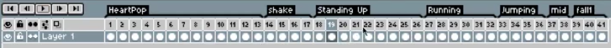

# Layer UI
- Timeline of frames
- Eye = toggle visibility of layer
- Lock = toggle editability of layer
    - if locked => can't draw or move layer
- Cell = toggle individual/linked cell frame
    - individual cell = every frame for this layer is independent
    - linked cell = every frame linked together for this layer is the exact same (for the length of the link in the timeline)
    - can mix and match linked/invidual cells for a layer over the timeline
- Onion skin
    - let's you see through the canvas to other timeframes => let's you trace to draw the next frame you need
    - adjust the window in the timeline to choose the window of frames you want to preview
- Timeline settings
    - Turn on thumbnail to get a preview of frames in timeline
    - Onion skin: change tint (Red/Blue for prev/next frames in window), opacity
        - show onion skin of current layer only
        - show onion skin behind/in front of current sprite 
- Frame menu (top bar)
    - Frame properties: duration of the frame
    - Cell properties: opacity of the cell
    - New Frame `Alt` + `N`
    - Duplicate Cells `Alt` + `D`
    - Remove Frame `Alt` + `C`
- Tagging frames
    - Select frames in timeline > Right click > Tag > name the frames (e.g. `running`)   

- Bottom right 1:1 launches preview window 
    - can play animation in the preview window to see changes 
    - right click play in preview window for speed and other options
