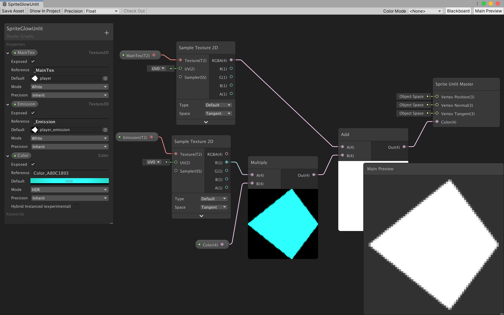

# Add 2D Lighting with Universal Render Pipeline (RP)
- [https://www.youtube.com/watch?v=nkgGyO9VG54](https://www.youtube.com/watch?v=nkgGyO9VG54)
- Unity 2019.2 or later
- Window > Package manager > Install Universal RP (render pipeline)
	- Installs shader graph for us too
- Project > Create > Rendering > Universal Render Pipeline > `Pipeline Asset`
	- name this `Pipeline Asset` then drag this asset into the asset slot in the Project Settings
	- This also creates a default `Forward (i.e. 3D) Renderer`
	- **For 2D: Project > Create > Rendering > URP > `2D Renderer`**
		- Select `Pipeline Asset` > Inspector > General > Renderer List > Drag `2D Renderer` into the slot
- Directory setup: 
    - `Assets/Renderer`
        - `2D Renderer`
        - `Pipeline Asset`
- Project Settings > Graphics > drag our `Pipeline Asset` into Scriptable Render Pipeline Settings slot
- For 2D lights:
	- To have sprites react to lights, change the sprite to use Sprite Renderer material: `Sprite-Lit-Default` shader
		- do this in one shot by Edit > Render Pipeline > Universal Render Pipeline > 2D Renderer > Upgrade Scene (or Project) to 2D Renderer
	- Leave the sprite's material as `Sprites-Default` if you don't need it to react to lights
	- That's it for setup
- Hierarchy -> Light -> 2D -> Pick light type
	- **Target Sorting Layers - set to "All" to light up all layers with this light**
		- **It is important to target layers with light or they won't show up at all!**
	- Intensity - how bright the light is
	- Color - the color of the light
	- Fall off - how drastically light falls off over distance (create cool glow effect)
	- Inner/Outer radius - center and radius of light
- **NOTE** After adding lights, your game will be dark unless you add a global light that targets `All` sorting layers
- Point light - add light that emits from a point
- Global light - lights up all elements in the scene uniformly
- Sprite light - add a sprite that will determine shape of light
- Free form light - create a shape that will be light
- Script
```c#
using UnityEngine.Experimental.Rendering.LWRP;
...
	torch = transform.Find("PointLight").gameObject.GetComponent<Light2D>();
	torch.intensity = lightIntensity;
	torch.pointLightOuterRadius = torchRadius;
	torch.color = Color.white;
```

# Adding Glow with bloom
- Brackeys is at it again (https://www.youtube.com/watch?v=WiDVoj5VQ4c)
	- Make sure you have URP set up as above
	- Requires you to create a custom shader (i.e. an emission map) that indicates which part of the sprite should glow 
- Add Bloom postprocessing effect
	- Enable effects on camera: Hierarchy > Main Camera > Inspector > Rendering > Check `Post Processing`
	- Enable HDR: Project > Assets/Renderer > Pipeline Asset > Inspector > General/Quality > Check `HDR`
	- Hierarchy > Create > Volume > Global Volume
		- Volume component > Add new profile
		- Add override > Bloom
		- The `Threshold` and `Intensity` properties are the most important: `Intensity` = intensity of the glow/bloom effect, `Threshold` = how bright an object needs to be before the post-processing glow effect is applied to it
		- Using `Threshold = 1` and `Intensity = 0.3` should make it so only objects we explicitly tell to glow will do so with intensity = 0.3
- Create emission map to indicate which parts of a sprite to glow
	- For sprite file (e.g. .psd Photoshop file): just highlight the parts of the sprite in white that you want to glow (change opacity of the white to change relative intensity of the glow), hide everything else, and make a black background; this is the emission map for your sprite
	- Add it as a secondary texture to the sprite:
		- Select the emission map sprite in Project > Assets => set `Texture Type` to `Default` instead of `Sprite 2D`
		- Make sure all other settings are the same as your Sprite's (e.g. Filter: Point and Compression: None)
		- Go to the primary sprite and open its Sprite Editor > Top left dropdown > Secondary Textures > + add your emission map as a secondary texture: name it `_Emission` and drag the emission map sprite into the `Texture` slot 
- Create a shader that uses the emission map
	- Project > Create > Shader > 2D Renderer > Shader Unlit Graph (if you want the sprite to stay unlit, except for where you specified with the emission map): name it `SpriteGlowUnlit`
	- Create a corresponding material: Right click shader > Create > Material (name it the same name as your sprite)
		- Drag it into the `Material` slot on your sprite's Sprite Renderer
		- The shader doesn't yet know what Sprite to display for the material => you'll get a `Material does not have a _MainTex texture property` warning 
	- Double click the shader to open the shader graph 
		- If you don't see the blackboard: https://answers.unity.com/questions/1501592/properties-panel-missing-in-shader-graphproperties.html
			- basically you'll have to rebuild the project (switching to another version of Unity does this by default)
		- To display sprite: Blackboard > + Property: Texture2D > Name it `MainTex` and set the reference to exactly `_MainTex`, indicating that this is the sprite we want to display for this shader 
			- Set `Default` to the primary sprite (e.g. player.psd)
			- Right click preview -> Quad to see it 
		- Drag the _MainTex into the shader graph to make it a node
		- From the output of the _MainTex node, drag it into a new `Sample Texture 2D` node, converting the texture into color data => drag output of the Sample Texture 2D RGBA into the `Color` input of the `Sprite Unlit Master` node 
	- To add the emission map into the shader graph: + Property: Texture2D > Name it `Emission` and set the reference to the same thing we put as the secondary texture name (i.e. `_Emission`) => Unity automatically finds this property and input our emission map
		- do the same thing with this node: output it into a `Sample Texture 2D` => add it to the output of `_MainTex` (since the emission map is white and black => just output one of the RGB outputs into the Add node) and take the result into the `Color` input of `Sprite Unlit Master`
		- this should result in a glow
	- To change the color of the glow, in shader graph: + Property: Color 
		- drag the node into the graph, multiply it with the output out of the `_Emission`'s `Sample Texture 2D` node 
		- set Mode: HDR, change the color (`Default`) and set the intensity of it to 2 
	- Now you can change the sprite material (i.e. the appearance of the sprite), secondary texture (i.e. the emission map) and the glow color all from the material properties in the inspector!
		- You can also change this stuff (i.e. the glow color) from script!



