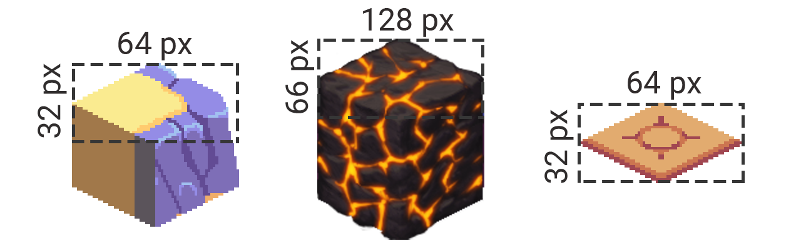

# Splitting sprite into multiple tiles
- Select sprite in Project > Inspector
- `Sprite Mode`: `Multiple`
- Set appropriate `Pixels per unit` (e.g. 32)
- Sprite Editor >
    - Slice > Pixel size (e.g. `32 x 32`)
    - Apply

# Unity tutorial
Following this [blog](https://blogs.unity3d.com/2019/03/18/isometric-2d-environments-with-tilemap/?utm_source=youtube&utm_medium=social&utm_campaign=engine-global-generalpromo-2019-03-18&utm_content=video_learn-isometric)

## Isometric Tilemap
### Project settings
- Works with 2D sprites, relying on correct sorting order for rendering (further tiles are painted first and are painted over by closer tiles).
- To customize the order which sprites are painted on screen: use `Custom Axis Sort`
    - can be defined per-camera or global project level (default/most cases)
    - Project Settings -> Graphics -> Transparency Sort Mode (Custom Axis)
        - Sort Axis = (X, Y, Z)
        - Default for this is (0, 0, 1) means to sort objects by their Z-position
        - We want (0, 1, 0) => objects are sorted by their Y-position or height on screen => tiles placed higher on the screen are sorted behind those placed lower => isometric view effect

### Types
- `Isometric` and `Isometric Z as Y`: the difference comes when simulating different tile elevation levels (e.g. when there's a raised platform in our Isometric level).
- A regular `Isometric Tilemap` is used when you wish to create *separate* Tilemap Game Objects for each individual elevation level of the tiles, which will simplify the process of creating automatic collision shapes, but has less flexibility in height variation between tiles (all tiles on 1 layer have to be on the same ‘plane’).
- For `Isometric Z as Y Tilemap`: the Z position value of each tile works in combination with the custom Transparency Axis Sort setting to make the tiles appear as stacked on top of one another. When painting on a Z as Y Tilemap, we dynamically adjust the Z setting on the brush to switch between different heights. The Z as Y Tilemap requires an additional Z value in the Custom Transparency Sort Axis to render correctly.

### Assets
- [Starter pack ($25)](https://assetstore.unity.com/packages/2d/environments/2d-isometric-tile-starter-pack-27944?_ga=2.84095065.1773159753.1584750701-1431738031.1576306455)

### Creating Tilemap
- **Hierarchy -> 2D Object -> Select Tilemap type**
- Grid = the ‘easel’ that holds your Tilemap Game Objects 
- Tilemap = canvases that you will be painting your tiles onto
    - => also need a brush and a palette
    - Tile Palette is what holds your tile assets => can pick them with the brush tool and start painting
- **Window > 2D > Tile Palette**
    - **Top left dropdown > `Create New Palette`**
    - Set the grid type to your use case (e.g. `Isometric` in this case)
    - Set the palette cell size to Manual to be able to customize the dimensions of your isometric tiles. 
        - In this case, I know that the dimensions of my tiles correspond to a grid of 1 in X and 0.5 in Y; however, for your use case, it will depend on the resolution, pixels per unit values selected at import and dimensions of the assets – essentially, on the isometric angle at which the tiles are rotated.
    - A general rule based on your initial asset dimensions: 1. Take a look at the resolution of your tiles. Typically, isometric tiles that are represented as a block are taller than they are wide; ‘flat’ tiles (ones that appear as a plane rather than a cube) are wider than they are tall. However, the width will always be the same between them. Therefore, **if you want your tiles to take up exactly one Unity unit, set the Pixels Per Unit value in the tile import settings equal to their width in pixels**. You may want to adjust this value in some cases – usually by decreasing it (or increasing the actual resolution of your assets); this could be useful if you are trying to produce an effect where some tiles appear to take up more than one grid cell and overlay the neighboring tiles.
    - **For the correct Y grid value for the tiles, take the height of the base (or cap) of a single tile, and divide it by the width. This will give you a Y value relative to the X, provided that X is 1**
        - e.g. Tiles with a base height of 32 pixels, and width of 64 pixels => use grid size: X = 1, Y = 0.5.

### Basic workflow
- Organize your Tilemap assets like:
    - Assets
        - Tilemaps
            - Colliders
            - **Palettes**
            - RuleTiles
            - **Sprites**
            - **Tiles**
- **To add tiles to our palette: drag tile sprites over into the Tile Palette window**
    - This creates a Tile Asset, containing info about the tile itself (e.g. the sprite(s) that it is using, a tint color, and the type of collider it generates)
    - For detailed info about a tile on the palette, choose the Select (S) tool at the top of the Tile Palette window and click on that tile => can see which Tile asset it is referencing in the Inspector
    - **To paint the Tile** onto our Tilemap, select the Brush (B) tool, and click the Tile in the Palette. You will now be able to paint with the selected Tile in the scene view. Some other painting tools include the Eraser (D), Box Fill (U), Flood Fill (G), and the Tile Picker (I).
    - Sometimes, you might also wish to edit the arrangement of the tiles in the palette itself. Just below the toolbar, you will see an Edit button. If you click it, you will go into the palette editing mode, during which the tools will affect the Tile Palette itself. Don’t forget to exit out of this mode once you’ve made the desired changes.
- `Chunk mode` reduces performance cost of Tilemap. Instead of rendering each tile individually, it batch renders them in one go, as a large block (see blog for more info)
    - 2 main drawbacks to using it. The first one is the fact that it does not support dynamic sorting with other 2D objects in the scene. This means that if your Tilemap is in Chunk mode, it will not be able to dynamically sort behind and in front of other objects, such as characters – only one or the other will be possible at a time, based on the Order in Layer setting. However, it is still extremely effective when you want to optimize your game, and can be used to batch render large areas of the ground.
    - However, this does not get around the issue of different tiles not sorting with each other. In order to batch-render tiles that come from two or more different sprites (i.e. textures), the sprites have to be unified under a single `Sprite Atlas` asset.
### Adding props or elevated areas (separate Tilemaps on the same grid)
- Use more than one Tilemap on the same Grid to add prop objects to the level that also align with the grid OR to add tiles that appear to be higher than the first layer.
- To attach another Tilemap to the grid: right-click on the Grid Game Object > create new Tilemap of the corresponding type
- In order to switch to painting on the new Tilemap, go back to the Tile Palette window, and *change the Active Tilemap just below the main toolbar*.
- Adding elevation 
    - For normal Isometric Tilemaps, you can simply create a new Tilemap under the same Grid; and *give it a higher Order in Layer value* => change the Tile Anchor setting to make the new layer anchor to a higher point on the grid
        - e.g. ground-level Tilemap had a Tile Anchor of (0, 0) for X and Y respectively
        - => new layer painted one unit higher will have it's Tilemap anchor point set to (1, 1) and an `Order in Layer` of 1 (one unit higher than base level)
        - => change active Tilemap to the one with the second height level and paint away
    - Sometimes it can be useful to simulate different heights using the same Tilemap. For this case, you can use a `Z as Y Isometric Tilemap and Grid` (see blog for this)
### Adding collision
- Use collision to control the areas that the player can go to and transition between them
- Many approaches to adding collision
    - can define collision by hand using an additional Tilemap.
    - e.g. create some sprites that correspond to the different shapes that we will use to define our collision areas => paint these shapes onto our third Tilemap, in the areas that we do not want the player to pass over (border area - can also add a custom Material in our Tilemap Renderer component in order to tint the tiles a different color that is distinct from the rest of our level)
- Once we have placed our collision tiles => add a `Tilemap Collider` component to the collision Tilemap. This auto-generates colliders for each individual tile based on the shape of the sprite
- For better performance, add a `Composite Collider 2D` component, and make sure to tick `Used by Composite` on our `Tilemap Collider`. This unifies all of our individual colliders into one big shape
### Misc (see blog)
- Adding props
- Rule tiles 
- Character control on isometric tilemap

# Simple Tilemap (Brackeys)
- 2DObject --> TileMap
- Import photoshop file
	- sprite mode: multiple
	- pixels per unit: 32 (or whatever)
	- filter mode: Point 
	- compression: none
	- Sprite editor to slice tiles
- Tilemap object (child of Grid) = a layer 
- Window --> 2D --> Tile Palette
	- Create new Palette (save in Assets/Palettes)
	- Drag sprite sheet over to the Tile Palette area, save tiles in Assets/Tiles/[what ever these tiles are]
	- Use Active Tilemap dropdown to select which tilemap layer to draw tiles onto
	- use brush tool (B) in Tile Palette, select tile(s) you want to paint onto the grid
	- Select tool to select tiles, move tool to move selected tiles
- Edit --> Project Settings --> Quality --> Disable anti aliasing to remove blurred edges/lines between your tiles
- Check end of Brackeys video for **animated tiles** and **rule based tiles** (have tile map auto detect which tiles should be placed based off neighboring tiles, e.g. like road building): [https://www.youtube.com/watch?v=ryISV_nH8qw](https://www.youtube.com/watch?v=ryISV_nH8qw)
