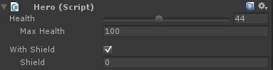

# Custom Unity Editor Window
- Brackeys video: https://www.youtube.com/watch?v=491TSNwXTIg
- Create your own custom Unity editor window, which you access via Window > `<Custom Editor Name>`
## Code
```c#
using UnityEngine;
using UnityEditor;

public class ExampleWindow : EditorWindow {
    string myString = "Hello, World!";
    Color color;

    /**
        This will make the window show up if you click Window > Example in the Unity editor 
    */
    [MenuItem("Window/Example")]
    public static void ShowWindow() {
        //Create window if not on screen, else just focus on it 
        string windowTitle = "Example";
        EditorWindow.GetWindow<ExampleWindow>(windowTitle);

    }

    void OnGUI() {
        //window code goes here
        GUILayout.Label("This is a label.", EditorStyles.boldLabel);

        //add text field called "Name"
        myString = EditorGUILayout.TextField("Name", myString);

        //add button
        if (GUILayout.Button("Press me")) {
            Debug.Log("Button was pressed");
        }

        //color field
        color = EditorGUILayout.ColorField("Color", color);
        if (GUILayout.Button("Colorize")) {
            //get all currently selected gameObjects and change their color to the color field
            foreach(GameObject obj in Selection.gameObjects) {
                Renderer renderer = obj.GetComponent<Renderer>();
                if (renderer != null) {
                    renderer.sharedMaterial.color = colo;
                }
            }
        }
    }
}
```

# Custom editor (Inspector)
- https://blog.theknightsofunity.com/use-customeditor-customize-script-inspector/
- Change how Unity displays a script (`MonoBehaviour` or `ScriptableObject`) in the Inspector
- Editor scripts are not included in the build (exist only in the Unity editor)
- Must be placed in a folder hierarchy that contains an `Editor` directory in the path:
    - e.g. `Assets/Editor/MyCustomEditor.cs` or `Assets/MyGame/Editor/MyCustomEditor.cs`

## Code
```c#
using UnityEngine;
 
public class Hero : MonoBehaviour {
    public int health = 0;
    public int maxHealth = 100;
    public bool withShield;
    public int shield = 0;
    public int maxShield = 0;
}
```


```c#
using UnityEditor;
using UnityEngine;
 
/**
    Need to pass in type of script you want to modify the Inspector for 
*/
[CustomEditor(typeof(Hero))]
public class HeroEditor : Editor {
    // SerializedProperty for each script property handles undo and persistence
    private SerializedProperty health;
    private SerializedProperty maxHealth;
    private SerializedProperty withShield;
    private SerializedProperty shield;
 
    private void OnEnable() {
        health = serializedObject.FindProperty("health");
        maxHealth = serializedObject.FindProperty("maxHealth");
        withShield = serializedObject.FindProperty("withShield");
        shield = serializedObject.FindProperty("shield");
    }
 
    public override void OnInspectorGUI() {
        serializedObject.UpdateIfDirtyOrScript();
 
        //use slider (min value of 0 and max value)
        EditorGUILayout.IntSlider(health, 0, maxHealth.intValue, "Health");
 
        EditorGUI.indentLevel++;
        EditorGUILayout.PropertyField(maxHealth, new GUIContent("Max Health"));
        EditorGUI.indentLevel--;
 
        EditorGUILayout.Space();
 
        EditorGUILayout.PropertyField(withShield, new GUIContent("With Shield"));
 
        if (withShield.boolValue) {
            EditorGUI.indentLevel++;
            EditorGUILayout.PropertyField(shield, new GUIContent("Shield"));
            EditorGUI.indentLevel--;
        }
 
        serializedObject.ApplyModifiedProperties();
    }
}
```
This is how the inspector for the `Hero` script will look after the custom editor is implemented:
